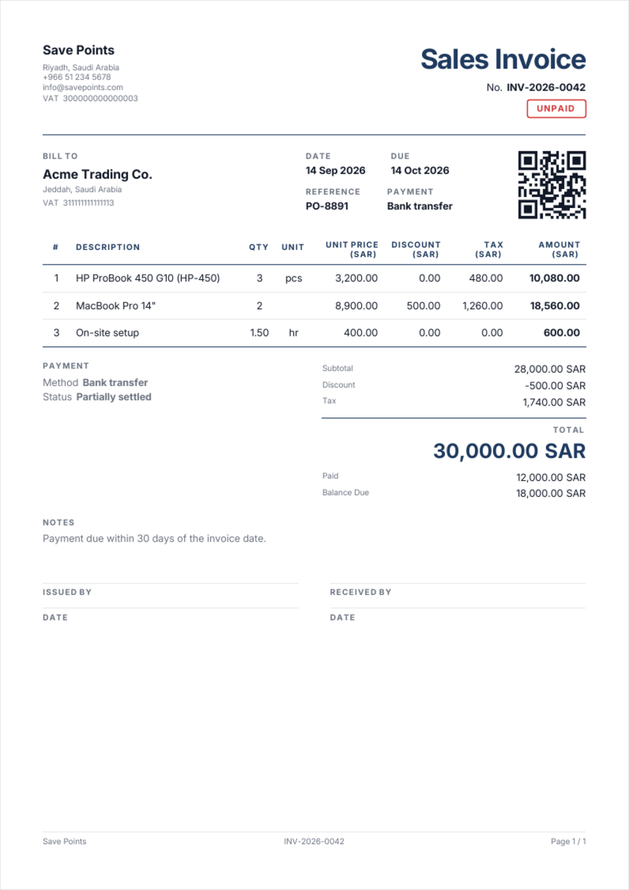
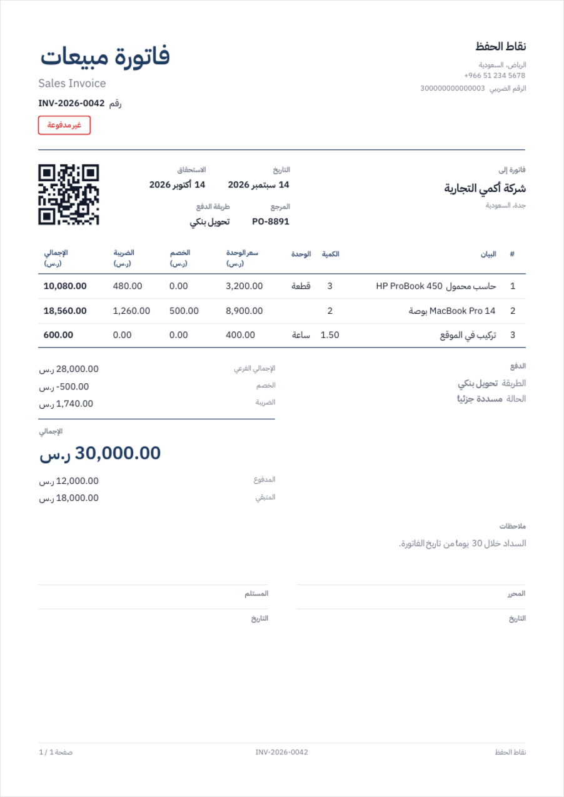
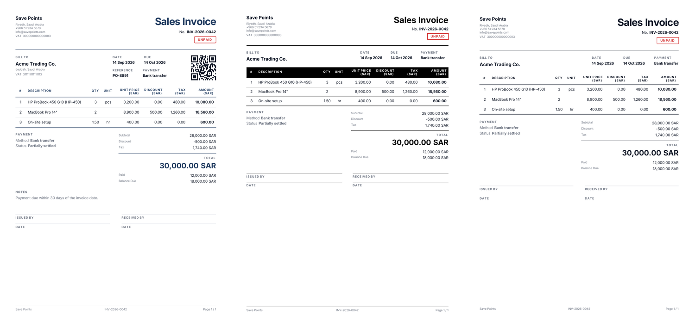

<div align="center">

# Save Points PDF Templates

### Printable business documents for Flutter — invoices, expense records, vouchers and reports — with first-class Arabic/RTL rendering

[](https://pub.dev/packages/save_points_pdf_templates)
[](https://flutter.dev)
[](LICENSE)
[](https://github.com/m7hamed-dev/save_points_pdf_templates/pulls)

[**📚 Documentation**](https://github.com/m7hamed-dev/save_points_pdf_templates#readme) · [**🧪 Example app**](example) · [**🐛 Report Bug**](https://github.com/m7hamed-dev/save_points_pdf_templates/issues) · [**✨ Request Feature**](https://github.com/m7hamed-dev/save_points_pdf_templates/issues)

</div>

---

Hand it a typed model, get a laid-out PDF. The package owns the parts that are
tedious to get right — page breaks inside long tables, repeating table headers,
right-to-left mirroring, mixed Arabic/Latin text, money and date formatting —
so your code only describes the document.

```dart
final bytes = await PdfGenerator.generate(
  template: SaleInvoiceTemplate(data: invoice, pdfConfig: config),
);
```

<div align="center">




<sub>The same document, the same code, two directions.</sub>

</div>

## Table of Contents

- [Features](#-features)
- [Installation](#-installation)
- [Quick Start](#-quick-start)
- [Templates](#-templates)
- [Configuration](#️-configuration)
- [Theming](#-theming)
- [Labels & languages](#️-labels--languages)
- [Arabic & RTL](#-arabic--rtl)
- [Output](#-output)
- [Custom Templates](#-custom-templates)
- [Tips & Best Practices](#-tips--best-practices)
- [Troubleshooting](#-troubleshooting)
- [Roadmap](#️-roadmap)
- [Changelog](#-changelog)
- [Contributing](#-contributing)
- [License](#-license)

## ✨ Features

| Feature | Description |
|---------|-------------|
| 🧾 **Thirteen documents** | Invoices, expenses, quotations, purchase orders, delivery notes, credit and debit notes, receipt and payment vouchers, statements, payslips, till receipts and free-form reports |
| 🔤 **Arabic / RTL** | Mirrored layout, bilingual labels, and per-run script handling so `HP ProBook` inside Arabic text is not printed backwards |
| 🗣️ **Any language** | Every word the package prints is a named getter on `PdfLabels` — a third language is a subclass, not a fork of every template |
| ©️ **Copy marks** | `DRAFT`, `COPY`, `VOID` set diagonally behind the page, the one thing that survives a photocopier |
| 📄 **Real pagination** | Long tables break across pages at row boundaries with the header repeated — no clipped rows, no infinite-page hangs |
| 🎨 **Themeable** | `PdfTheme` drives every color, size, spacing and label tracking; three presets plus `copyWith` |
| 🧮 **Totals that add up** | Discount and tax as an amount *or* a rate, per line or per document, with a tax breakdown by rate for a GCC tax invoice |
| 💰 **Money, properly** | Decimal places follow the currency — three for KWD and BHD, none for JPY — and due dates make a document say `OVERDUE` |
| 💱 **Locale-aware** | Grouped thousands, sensible quantity decimals, and dates through `intl` |
| 🔠 **Your fonts** | No bundled TTFs — point at an asset, hand over a `pw.Font`, and declare fallbacks for missing glyphs |
| 🖨️ **Preview & share** | A ready-made preview page, plus headless `bytes` / `share` / `print` / `thumbnail` |
| 🧩 **Composable** | `PdfUi` primitives and `PdfSections` blocks are public — build your own template from the same parts |

## 📦 Installation

```bash
flutter pub add save_points_pdf_templates
```

Or add it by hand:

```yaml
dependencies:
  save_points_pdf_templates: ^0.3.0
```

> [!IMPORTANT]
> The package ships **no fonts**. The built-in PDF fonts are Latin-only, so
> Arabic renders as empty boxes until you supply a TTF. Declare one in your
> app and pass its path — see [Arabic & RTL](#-arabic--rtl).

## 🚀 Quick Start

**1. Declare a font in your app's `pubspec.yaml`**

```yaml
flutter:
  assets:
    - assets/fonts/IBMPlexSansArabic/IBMPlexSansArabic-Regular.ttf
    - assets/fonts/IBMPlexSansArabic/IBMPlexSansArabic-SemiBold.ttf
```

> [!TIP]
> For Arabic, pick a family that ships the legacy Arabic Presentation Forms-B
> block — IBM Plex Sans Arabic and Noto Naskh Arabic do. Most Google Fonts
> Arabic families, Cairo and Tajawal included, leave those shapes to OpenType,
> and the renderer drops a word-final `ي` after `ر`, `ا`, `د`, `و` or `ز`.
> See [Troubleshooting](#-troubleshooting).

**2. Build a config once and keep it** — fonts and the logo are decoded on the
first render and reused afterwards.

```dart
final config = PdfConfig(
  fontPath: 'assets/fonts/IBMPlexSansArabic/IBMPlexSansArabic-Regular.ttf',
  boldFontPath: 'assets/fonts/IBMPlexSansArabic/IBMPlexSansArabic-SemiBold.ttf',
  logoPath: 'assets/images/logo.png',
  locale: 'ar',
  currency: 'ر.س',
  company: const PdfPartyModel(
    name: 'Save Points',
    phone: '+966 51 234 5678',
    taxNumber: '300000000000003',
  ),
);
```

**3. Describe the document**

```dart
final invoice = PdfSaleInvoiceModel(
  id: 'INV-2026-0042',
  date: DateTime.now(),
  customer: const PdfPartyModel(name: 'Acme Trading Co.'),
  items: const [
    PdfInvoiceItemModel(title: 'HP ProBook 450', qty: 3, price: 3200),
    PdfInvoiceItemModel(title: 'On-site setup', qty: 1.5, price: 400, unit: 'hr'),
  ],
  taxRate: 15,                       // or `tax:` per line, as an amount
  dueDate: DateTime.now().add(const Duration(days: 30)),
  paymentMethod: 'Bank transfer',
  paidAmount: 5000,
);
```

**4. Preview, share or print it**

```dart
Navigator.of(context).push(MaterialPageRoute(
  builder: (_) => PdfPreviewPage(
    template: SaleInvoiceTemplate(data: invoice, pdfConfig: config),
  ),
));
```

## 📄 Templates

| Template | Model | Layout |
|----------|-------|--------|
| `SaleInvoiceTemplate` | `PdfSaleInvoiceModel` | Masthead, customer + meta cards, item table, totals panel, notes, signatures |
| `ExpensesInvoiceTemplate` | `PdfExpensesInvoiceModel` | Same, with a payee card and an expense category |
| `InvoiceTemplate` | `PdfInvoiceModel` | The minimal invoice — number, customer name, lines; signatures off |
| `ReceiptVoucherTemplate` | `ReceiptVoucherModel` | Prominent amount, dotted fill-in fields, two signature slots |
| `PaymentVoucherTemplate` | `PaymentVoucherModel` | The same, mirrored — money out rather than in |
| `QuotationTemplate` | `PdfQuotationModel` | Priced but not owed — valid until a date, signed to accept |
| `DeliveryNoteTemplate` | `PdfDeliveryNoteModel` | The item table with every price taken out, plus a receipt signature |
| `StatementOfAccountTemplate` | `PdfStatementModel` | Opening balance, movements, a running balance and what is owed |
| `PurchaseOrderTemplate` | `PdfPurchaseOrderModel` | Addressed to a supplier, with a delivery address and an expected date |
| `CreditNoteTemplate` / `DebitNoteTemplate` | `PdfCreditNoteModel` / `PdfDebitNoteModel` | Names the invoice it corrects and why, above the signatures |
| `PayslipTemplate` | `PdfPayslipModel` | Earnings beside deductions, net pay beneath — the net is computed |
| `ThermalReceiptTemplate` | any itemized model | An 80mm or 57mm till roll: one column, no grid, page grows to fit |
| `ListStringsTemplate` | `PdfListStringsModel` | Free-form table: you supply headers and rows, it supplies the chrome |

<details>
<summary><b>Free-form tabular reports</b></summary>

```dart
ListStringsTemplate(
  pdfConfig: config,
  data: PdfListStringsModel(
    id: 'RPT-2026-09',
    title: 'Monthly Stock Count',
    date: DateTime.now(),
    headers: const ['SKU', 'Item', 'On hand', 'Counted'],
    columnFlex: const [1.4, 3, 1, 1],
    items: rows,                                   // List<List<String>>
    summary: const {'Lines': '128', 'Variance': '-12'},
  ),
);
```

</details>

<details>
<summary><b>Receipt vouchers</b></summary>

```dart
ReceiptVoucherTemplate(
  pdfConfig: config,
  qrCode: 'RV-2026-0031',
  data: ReceiptVoucherModel(
    id: 'RV-2026-0031',
    date: DateTime.now(),
    payerName: 'Acme Trading Co.',
    amount: 12500,
    amountInWords: 'Twelve thousand five hundred Saudi Riyals',
    paymentMethod: 'Bank transfer',
    statement: 'Part settlement of invoice INV-2026-0042',
    receiverName: 'Mohamed Syed',
  ),
);
```

</details>

## ⚙️ Configuration

`PdfConfig` is concrete — the common case needs no subclass.

| Option | Description |
|--------|-------------|
| `fontPath` / `boldFontPath` | Asset paths of the TTFs (default: none — built-in Latin font) |
| `font` / `boldFont` | Ready-made `pw.Font`s, e.g. from `PdfGoogleFonts` — take priority over the paths |
| `fallbackFontPaths` | Extra TTFs consulted for glyphs the main font lacks |
| `useBuiltInFallback` | Appends the built-in Latin font to the fallback chain (default: `true`) |
| `logoPath` / `logoBytes` | Issuer logo, drawn in the masthead |
| `logoSize` | Edge length of the logo box (default: `46.0`) |
| `company` | `PdfPartyModel` printed as the issuer |
| `currency` | Appended to money values (default: `'SAR'`) |
| `locale` | BCP 47 tag; anything starting with `ar` renders right-to-left (default: `'en'`) |
| `theme` | `PdfTheme` design tokens (default: `PdfTheme()`) |
| `pageFormat` | Default page size (default: `PdfPageFormat.a4`) |
| `strictFonts` | Throw `PdfAssetException` on a missing asset instead of falling back (default: `false`) |

> [!TIP]
> Turn `strictFonts` on in release builds. A typo in an asset path otherwise
> degrades silently to a Latin-only font, and you find out from a customer.

<details>
<summary><b>Loading fonts from somewhere other than assets</b></summary>

```dart
final config = PdfConfig(
  font: await PdfGoogleFonts.cairoRegular(),
  boldFont: await PdfGoogleFonts.cairoBold(),
  locale: 'ar',
);
```

`CairoPdfFontConfig` is a thin preset over the same class: Arabic locale,
`SAR`, and Cairo asset paths your app declares. Point `fontPath` at a family
that ships the Presentation Forms-B block before shipping Arabic documents —
see the note above.

</details>

## 🎨 Theming

Every color, type size and spacing value lives on `PdfTheme`.

```dart
const PdfTheme.modern();     // wide margins, one accent keyline — the default
const PdfTheme.classic();    // full grid, filled header, square corners
const PdfTheme.minimal();    // no fills, no row rules, the widest margins
const PdfTheme.modern(accent: PdfColor.fromInt(0xFF00695C));
```

The three are three documents, not three palettes. `modern` rations colour to
one keyline, the column labels and the amount due, and lets space do the
organising. `classic` rules everything, for a reader who expects ruled paper.
`minimal` is ink on paper: nothing between the rows but their own height.

The table header follows `headerStyle`:

| `PdfTableHeaderStyle` | Look |
|---|---|
| `underlined` | No fill; the header sits on an accent rule (default) |
| `soft` | Pale accent wash under accent labels |
| `filled` | Solid accent bar with reversed text |

Type sizes carry the hierarchy, so the amount due needs no box behind it:
`titleSize` for the document type, `displaySize` for the total, then
`headingSize` / `bodySize` / `captionSize`.

<div align="center">



<sub><code>modern</code> · <code>classic</code> · <code>minimal</code></sub>

</div>

Tweak a preset instead of writing one from scratch:

```dart
final theme = const PdfTheme.modern().copyWith(
  accent: PdfColors.teal700,
  showRowRules: false,                // separate rows by height alone
  headerStyle: PdfTableHeaderStyle.filled,
  labelTracking: 1.0,                 // tracking on small caps labels
  margin: const PdfMargin.all(48),
);
```

Pass it on the config for every document, or per template to override one:

```dart
SaleInvoiceTemplate(data: invoice, pdfConfig: config, theme: theme);
```

## 🗣️ Labels & languages

Every word the package prints is a getter on `PdfLabels`. English is the
default, Arabic comes automatically in a right-to-left document whose font can
draw it, and anything else is a subclass:

```dart
class FrenchLabels extends PdfLabels {
  const FrenchLabels();
  @override String get billTo => 'FACTURER À';
  @override String get subtotal => 'Sous-total';
  @override String documentType(PdfInvoiceType type) => 'Facture de vente';
  @override String documentSubtitle(PdfInvoiceType type) => '';
  // …everything not overridden stays English.
}

final config = PdfConfig(locale: 'fr', labels: const FrenchLabels());
```

That covers the document's own name too, so a French invoice is not headed
`Sales Invoice` — in the page, in the PDF's `/Title` and in the file name.

Use `BaseTemplate.tr(english, arabic)` only for a label of your own in a custom
template; it takes exactly two languages, which is what `PdfLabels` replaced.

## 🌍 Arabic & RTL

Set `locale: 'ar'` and the whole document mirrors: masthead, table columns,
alignment and the totals panel. Labels switch language through
`BaseTemplate.tr`, and the Arabic sub-title is dropped automatically when the
configured font cannot draw Arabic.

> [!WARNING]
> The renderer reverses whichever script run does not match the paragraph
> direction — `حاسب محمول HP ProBook` drawn as one right-to-left string comes
> out as `kooBorP PH`. The package splits mixed values into script runs
> (`PdfUi.bidiText`) and applies it to table cells, field values and party
> names. If you build a custom template, use `ui.bidiText` — not `ui.text` —
> for any value that can mix Arabic and Latin.

Money is rendered as two runs, the figure and the currency, for the same
reason. Use `ui.money(value)` rather than interpolating a string.

> [!WARNING]
> Letter spacing must never reach Arabic — it pulls the connected script
> apart, turning `الوحدة` into `لوحدة ا`. `PdfUi.text` drops `letterSpacing`
> on any value containing RTL script, and `ui.microLabel` tracks and
> upper-cases Latin only. Follow the same rule in custom code.

## 📤 Output

```dart
final bytes  = await PdfDocuments.bytes(template: template);
final shared = await PdfDocuments.share(template: template, fileName: 'INV-42');
final job    = await PdfDocuments.printDocument(template: template);
final png    = await PdfDocuments.thumbnail(template: template, dpi: 96);
```

`PdfPreviewPage` wraps `printing`'s preview with the share and print actions:

```dart
PdfPreviewPage(
  template: template,
  fileName: 'INV-2026-0042',
  canChangePageFormat: true,
);
```

## 🧩 Custom Templates

Subclass `BaseTemplate<T>` for a new document, or `ItemizedInvoiceTemplate<T>`
to reuse the invoice layout and change only what differs.

```dart
class DeliveryNoteTemplate extends ItemizedInvoiceTemplate<PdfSaleInvoiceModel> {
  DeliveryNoteTemplate({required super.data, required super.pdfConfig});

  @override
  String get partyLabel => tr('DELIVER TO', 'تسليم إلى');

  @override
  List<PdfColumnSpec> get columns => [
    PdfColumnSpec(tr('Item', 'الصنف'), flex: 4),
    PdfColumnSpec(tr('Qty', 'الكمية'), align: PdfCellAlign.center),
  ];

  @override
  List<List<String>> get rows =>
      [for (final item in data.items) [item.title, format.quantity(item.qty)]];
}
```

> [!IMPORTANT]
> `body` returns a **list** of blocks, not one widget. A page can only break
> between top-level blocks, so return long content — the item table above all —
> as its own entry. A table nested inside a column is forced onto one page and
> a long document will fail to render.

<details>
<summary><b>The building blocks</b></summary>

`ui` (`PdfUi`) — `text`, `bidiText`, `microLabel`, `caption`, `heading`,
`title`, `money`, `pair`, `card`, `accentBar`, `badge`, `stamp`, `stampArea`,
`keyline`, `rule`, `gap`, `inlineField`, `dottedField`, `qr`, `barcode`,
`logo`.

`sections` (`PdfSections`) — `documentHeader`, `partyAndMeta`, `partyCard`,
`metaCard`, `totalsPanel`, `totalsPanelText`, `infoBlock`, `notes`,
`signatures`, `pageFooter`.

`PdfDataTable` — the paginating table, built from `PdfColumnSpec`s.

`format` (`PdfFormatters`) — `money`, `number`, `quantity`, `percent`, `date`,
`dateTime`, `longDate`.

</details>

## 💡 Tips & Best Practices

1. **Build `PdfConfig` once.** It caches the decoded font and logo; a fresh
   instance per render re-reads the asset bundle every time.
2. **Let the model do the math.** Leave `total` null and read `subtotal`,
   `totalTax`, `total`, `paid` and `due` — pass `total` only to reproduce a
   figure computed elsewhere.
3. **Put the currency in the column header**, not in every cell. The itemized
   templates already do this; keep it if you override `columns`.
4. **Fill the space beside the totals.** `ItemizedInvoiceTemplate` puts payment
   details there via `settlementLines`; override it with bank details or
   delivery terms rather than leaving the area blank.
5. **Prefer `theme` over hard-coded colors** so a brand change is one line.
6. **Test the long case.** A document that fits one page hides pagination bugs
   in a custom template — render 100 rows in a test.

## 🔧 Troubleshooting

| Symptom | Cause | Fix |
|---------|-------|-----|
| Arabic prints as empty boxes | No TTF supplied; built-in fonts are Latin-only | Declare a font asset and set `fontPath` |
| Latin words inside Arabic read backwards | The value was drawn as a single mixed-script string | Use `ui.bidiText` (or `ui.money` / `ui.pair`) instead of `ui.text` |
| Digits or IDs read backwards | Same cause, in your own template | As above; `PdfUi.directionOf` shows what a value will be treated as |
| `PdfTooBigPageException` | A block that never fits is retried on each page — usually a table nested in a column | Return the table as its own entry from `body` |
| Numbers show as `3.00` where you wanted `3` | `format.number` always shows two decimals | Use `format.quantity` for counts |
| Arabic letters look detached | Letter spacing applied to a connected script | Use `ui.microLabel` / `ui.text`, which drop tracking on RTL text |
| An Arabic word loses its last letter — `المتبقي` prints as `المتبق` | The renderer asks the font for the legacy Arabic Presentation Forms-B codepoints. Most Google Fonts Arabic families — Cairo and Tajawal among them — leave the contextual shapes to OpenType and never map that block, so the isolated `ي` (`U+FEF1`) resolves to nothing and the next glyph collapses onto it. It affects a word-final letter after a non-connecting one: `ر`, `ا`, `د`, `و`, `ز` | Use a family that ships the legacy block — IBM Plex Sans Arabic or Noto Naskh Arabic. The example app uses IBM Plex Sans Arabic for exactly this reason |
| A font asset silently does nothing | Path typo, swallowed by the fallback | Set `strictFonts: true` to get `PdfAssetException` |

## 🗺️ Roadmap

- [x] Themeable design system and paginating tables
- [x] Mixed Arabic/Latin text handling
- [ ] ZATCA Phase 1 / Phase 2 QR payloads
- [ ] Thermal / ESC-POS output for 58 mm and 80 mm rolls
- [ ] Statement-of-account and delivery-note templates

## 📝 Changelog

See [CHANGELOG.md](CHANGELOG.md).

- **v0.3.0** — Templates redesigned around type and space; Arabic/RTL layout was mirrored twice and is now correct; font-capability and document-naming fixes.
- **v0.2.1** — Design pass: tracked labels, softer table header, filled totals gutter, Arabic letter-spacing fix.
- **v0.2.0** — Public API reworked, themeable design system, real pagination, Arabic/RTL correctness, tests.
- **v0.1.0** — Initial templates, models and PDF generation.

## 🤝 Contributing

Issues and pull requests are welcome at
[the issue tracker](https://github.com/m7hamed-dev/save_points_pdf_templates/issues).
See [CONTRIBUTING.md](CONTRIBUTING.md) for how this package is tested — the
output is a PDF, so "it compiles" proves very little. Before opening a PR:

```bash
dart format . && flutter analyze --fatal-infos && flutter test
```

## 📄 License

MIT — see [LICENSE](LICENSE).

<div align="center">

Made with ❤️ for Flutter

⭐ Star this repo if it helped you

</div>
